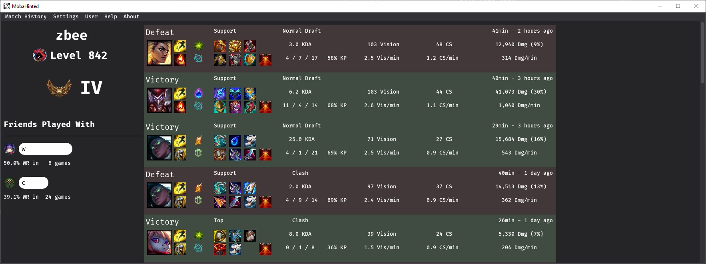
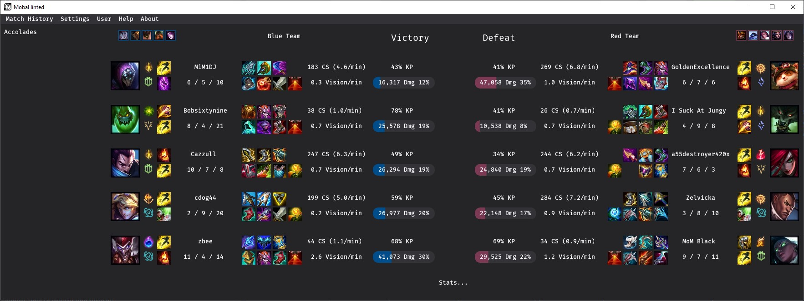

#  MobaHinted [](https://codeclimate.com/github/zbee/mobahinted/maintainability)
This is a tool for League of Legends that will have functionality similar to
Blitz / Mobalytics primarily, with the exclusion of ads, paid features, and the
inclusion of it just actually working while having everything you need.
It's faster, lighter, more reliable, more customizable, and with more overlays.

Made out of grief from both Mobalytics and Blitz commonly just not even having correct builds or
stats on matchups or even failing to import at critical moments, and completely
missing features like suggesting counter picks from your champion pool - not to mention all the ads.

It doesn't have crazy in-depth stats like Mobalytics, super nice visuals of Blitz, or the
particularly in-depth player tags or data-syncing of Porofessor, but it does have easy to
understand information of every type you could want in a clean and concise format, as well
as all the overlays those other clients have AND more that they don't.

## Status

This is rather early on in development, and I've never made desktop GUI software
before, so I'm sure there will be lots of hiccups.

You can stay tuned by Watching the project in the top right, or checking the
[Todo List](https://github.com/zbee/mobahinted/projects/1).

Current Status:
[](https://raw.githubusercontent.com/zbee/mobahinted/master/assets/status.jpg)
[](https://raw.githubusercontent.com/zbee/mobahinted/master/assets/status_match.jpg)

### Planned Features

This is roughly in the order they will be developed.

- [X] ~~Match History~~
- [X] ~~Post-Game Breakdown~~
  - [ ] Drill down into this: gold graph, baron kills, tower kills, etc
- [X] ~~Teammate Performance (like op.gg has, telling you your win-rate with specific friends)~~
  - [ ] Drill down into this: show your best champion with them, etc
- [ ] Match History with friend
- [ ] Champion Pool Tracking (graph your WR changes per-champ over chunks of time)
- [ ] Overlays
  - [ ] Milestone Notifications
  - [ ] Objective Reminders
  - [ ] Enemy Spell Tracker
  - [ ] Jungle Timers
  - [ ] Map Check Reminder
  - [ ] Gold Diff Tracker
  - [ ] Scoreboard Duos
  - [ ] Counter Item Suggestions
  - [ ] ARAM Health Timers
  - [ ] Back Reminder
  - [ ] Use Trinket Reminder
  - [ ] CS Tracker and Stats Window
- [ ] Current-play-session window
- [ ] Champion Suggestion (based on your pool, and performance with teammates)
- [ ] Ban Suggestion (based on your lane WRs, and performance with teammates)
- [ ] Item / Rune / Spell suggestions and importing (2 of the most popular, then try to have a variety - like some tools
      don't offer AP twitch anymore but if that's what you want ..., etc.)
- [ ] Riot API Caching/Proxying with Kernel

## Setup

When this is at a usable point (e.g. Rito accepts my app, and there are enough features to make it even vaguely
competitive), I'll release a binary for Windows, and all you will have to do is download and run that.

To spin it up in the mean-time you should just need Python 3 (built on 3.12) and the following steps:

1. `virtualenv venv
    && pip install -r requirements.txt`

2. You'll also need an `.env` file next to `main.py`/`mobahinted.exe` set up with the following variables.
    - `RIOT_API_KEY="<key goes here>"` with your [Riot API key](https://developer.riotgames.com/).

3. Then you can build the executable, or execute the program directly.

    - `python build.py` to build a `MobaHinted.exe`, then execute that.
    - `python main.py` to execute the program directly.

## What's the catch?

Nah. I play League, the clients/tools are annoying, and I want one that has all
of my favorite features without the ads or anything like that.

### Privacy

No data is automatically transmitted to me, except if you enable periodic
information dumps (disabled by default) for analytics and debugging purposes,
or if you include it in the feedback form.
The exact data included is up to you to select.

Your API requests are proxied through my server for caching and better rate
limiting, I just log accesses for rate-limiting purposes, but CloudFlare and
Vultr will have access to your data as well.

If you prefer, you can set up an environment variable as described in the Setup
section above, and then your API requests won't be proxied, and only Riot will
have access to any data in that case.

## Contributing

The biggest contribution would be trying it out, and opening an issue if you
find one.

If you want to code on this, try fixing an issue, or implementing something from
the ToDo list, and opening a pull request.

If you want to thank me, then email me, report an issue, or star this
repository; there are also Sponsor options on the GitHub page, go crazy.

## License
This software is licensed under GPLv3, and as such can be shared and modified freely.

`MobaHinted  Copyright (C) 2020  Ethan Henderson <ethan@zbee.codes>`

```
This program is free software: you can redistribute it and/or modify
it under the terms of the GNU General Public License as published by
the Free Software Foundation, either version 3 of the License, or
(at your option) any later version.

This program is distributed in the hope that it will be useful,
but WITHOUT ANY WARRANTY; without even the implied warranty of
MERCHANTABILITY or FITNESS FOR A PARTICULAR PURPOSE.  See the
GNU General Public License for more details.

You should have received a copy of the GNU General Public License
along with this program.  If not, see <https://www.gnu.org/licenses/>.
```

### Attribution

MobaHinted is not endorsed by Riot Games and does not reflect the views or opinions of Riot Games or anyone officially
involved in producing or managing Riot Games properties. Riot Games and all associated properties are trademarks or
registered trademarks of Riot Games, Inc.

---

[Cassiopeia](https://github.com/meraki-analytics/cassiopeia), 
Copyright (c) 2017 Rob Rua, Jason Maldonis - 
Licensed under the MIT License

[Kernel](https://github.com/meraki-analytics/kernel), 
Copyright (c) 2017 Meraki Analytics, LLC - 
Licensed under the MIT License

[lcu-driver](https://github.com/sousa-andre/lcu-driver), 
Copyright (c) 2019 André Sousa - 
Licensed under the MIT License

[Fira Code](https://github.com/tonsky/FiraCode), 
Copyright (c) 2014 The Fira Code Project Authors - 
Licensed under the OFL License

[Requests](https://github.com/psf/requests), 
Copyright 2011 Kenneth Reitz - 
Licensed under the Apache License (Version 2.0)

[python-dotenv](https://github.com/theskumar/python-dotenv), 
Copyright (c) 2014, Saurabh Kumar - 
Licensed under the 3-Clause BSD License

[timeago](https://github.com/hustcc/timeago), 
Copyright (c) 2016 hustcc - 
Licensed under the MIT License

[NumPy](https://github.com/numpy/numpy), 
Copyright (c) 2005 NumPy Developers - 
Licensed under the 3-Clause BSD License
